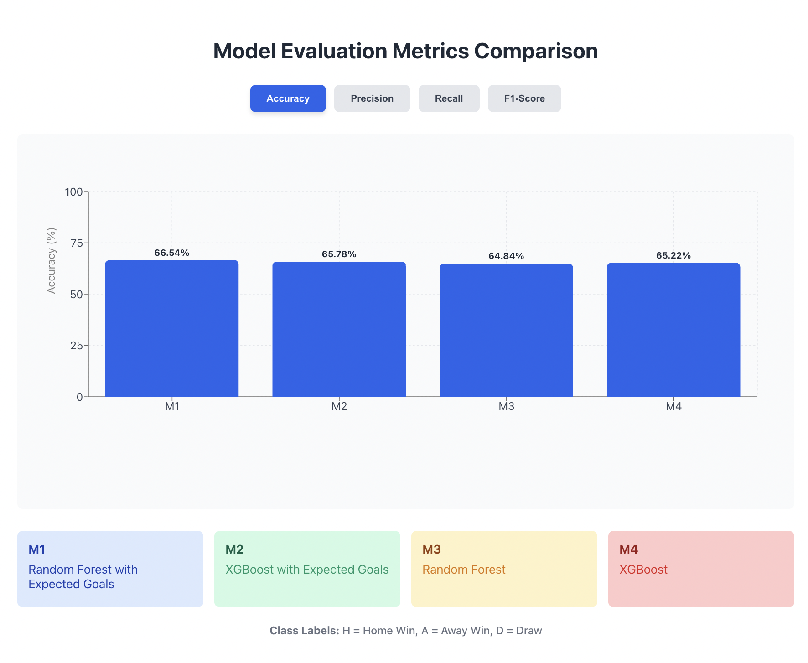

<a href="https://github.com/AlbarR19/bachelor-thesis" target="blank">
<h2> Addition of Expected Goals (xG) in Football Match Outcome Prediction Based on Match Statistics Using Random Forest and XGBoost</h2>
</a>

The popularity of football around the world has encouraged football to become more modernized, one of which is the use of data-driven approach in decision making in football. One evidence of its development is the presence of a modern statistical metric, namely expected goals (xG), which is believed to be able to assess the course of a match by separating the quality of team performance and luck factors after the full time whistle. This research proposes a method of adding xG features in football match outcome prediction into the match statistics dataset. This research uses the English Premier League match statistics dataset from 2017/2018 to 2023/2024. The addition of xG features provided by Opta and acquired through football reference (FBREF), this method aims to improve the performance of the model. The method was evaluated using confusion matrix, accuracy, precision, recall, and F1-score metrics.
This research implements a machine learning model for football match prediction. Web scraping and pre-processing methods are applied to improve the prediction accuracy value. The results showed that the addition of xG features resulted in a increase in accuracy, reaching an increase of 0.5% to 1.5%. The highest performance was achieved by the Random Forest model with the addition of xG resulting in an accuracy value of 66.54%.

### Keyword: 
Football Match Outcome Prediction, Expected Goals, XG, Machine Learning, XGBoost, Random Forest

